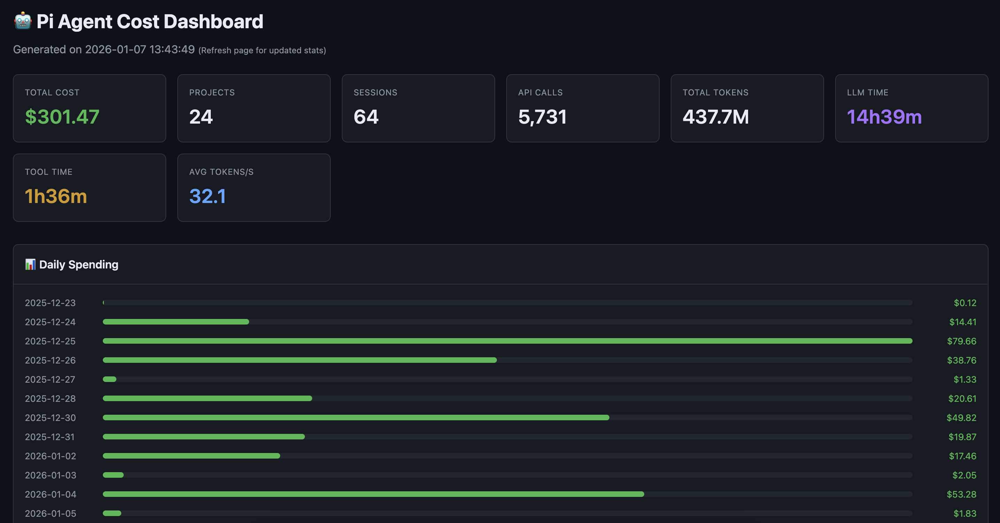
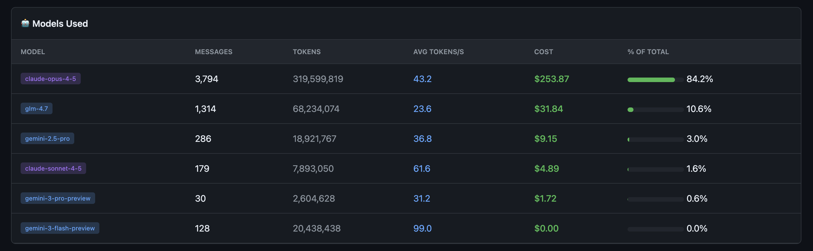
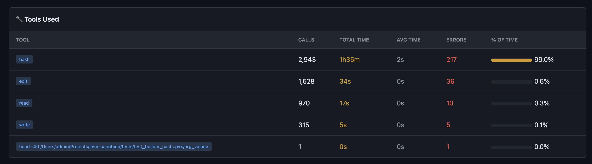
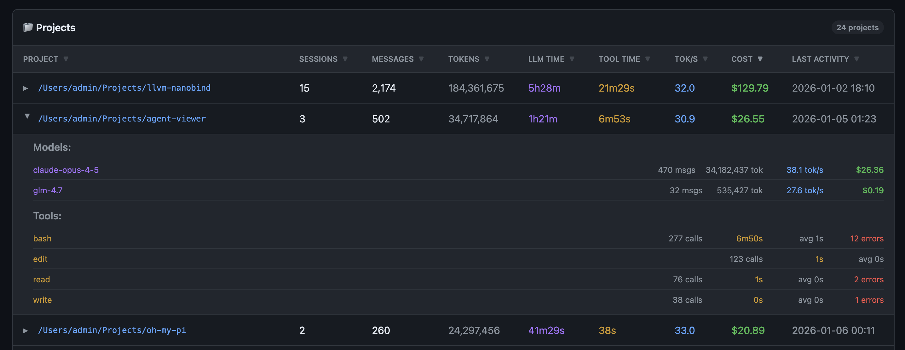
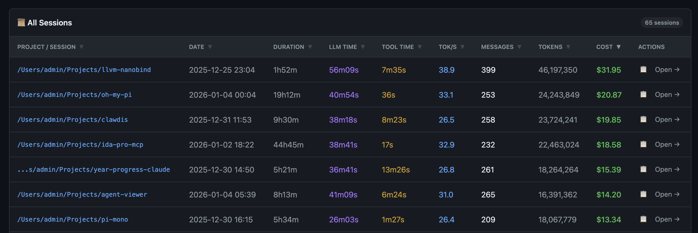

# Cost Dashboard

Web dashboard to monitor local API costs for common coding agents (Pi, Oh My Pi, Claude Code, Codex CLI, Gemini CLI, and related tools).

No external dependencies — pure Python stdlib.



## Features

### Global Statistics
Track total spending across all projects and sessions:
- Total tokens broken down by input, output, cache-read, cache-write, and reasoning counts when exposed
- Detailed token usage across all models where source data exposes it
- Session count and project count
- LLM time vs tool execution time
- Average tokens per second across all API calls

### Daily Spending Chart
Timeline of API costs over time.

### Model Breakdown
Costs broken down by AI model (Claude, Gemini, GPT-5, O3, O4, GLM, etc.):
- Messages, input/output/cache-read/cache-write/reasoning token usage, and cost per model
- Average tokens per second



### Tool Usage
Track which tools your agent uses most:
- Call counts and execution time per tool
- Error rates



### Project View
All projects with expandable details:
- Per-project cost, model usage, tool usage, and session history
- Sortable by cost, tokens, LLM time, or date



### Session Browser
Browse every session with full details:
- Copy command to resume session to the clipboard
- Full transcript export (Pi via `pi --export`, Claude and Codex via built-in exporters)
- Session duration, LLM time, and tool time
- Subagent session support with expandable grouping
- Sortable by date, duration, cost, tokens, and more



## Installation

Requires **Python 3.12+**.

```bash
git clone https://github.com/user/ai-cost-history-hub
cd ai-cost-history-hub
```

## Usage

```bash
# Start the dashboard (defaults to localhost:8753)
./cost_dashboard.py

# Use a custom port
./cost_dashboard.py --port 3000

# Bind to all interfaces (accessible from network)
./cost_dashboard.py --host 0.0.0.0

# Custom host and port
./cost_dashboard.py -H 0.0.0.0 -p 3000
```

On Windows, you can also double-click `start.bat`.

Then open http://localhost:8753 in your browser.

## Session Directories

The dashboard automatically reads session data from:

| Agent | Directory |
|---|---|
| Pi | `~/.pi/agent/sessions` |
| Oh My Pi | `~/.omp/agent/sessions` |
| Claude Code | `~/.claude/projects` |
| Codex CLI | `~/.codex/sessions` |
| Gemini CLI | `~/.gemini/tmp` |

## CLI Utilities

### claude_cost.py / gemini_cost.py

Calculate API costs for agent sessions:

```bash
python claude_cost.py /path/to/sessions
python gemini_cost.py ~/.gemini/tmp/project/chats
```

### claude_export.py / codex_export.py / gemini_export.py

Export a session JSONL file to a styled HTML transcript:

```bash
python claude_export.py input.jsonl output.html
python codex_export.py input.jsonl output.html
python gemini_export.py input.jsonl output.html
```

## Pricing

Costs are calculated using pricing reported by the agent. For models that don't report costs (e.g., Gemini via Google Cloud), estimated pricing is applied based on public API rates. Supported model families: Claude, Gemini, GPT-5, O3/O4, GLM.